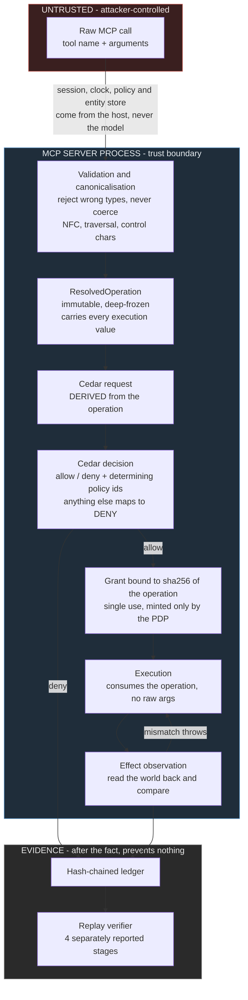

# mcp-authority-boundary

**Correct mediation is not sufficient: separating enforcement, authorization-execution binding, and policy adequacy at the MCP tool boundary.**

Every test passed. The replay verifier said VERIFIED. The mediation invariant held. And a 100,000-byte write went through a policy that capped writes at 4,096 bytes.

That is not a story about a bug. It is the artifact's result. Authorization assurance has layers that fail independently, and the usual green signals cannot tell them apart.

---

## Abstract

Authorization at an AI agent's tool boundary is usually treated as one property: either the policy engine is in the path or it is not. This artifact separates it into properties that fail independently. A Cedar-enforced Model Context Protocol server mediates six tools across 24 adversarial scenarios, recording every decision in a hash-chained ledger with an independent replay verifier.

The first version passed 66 tests, replayed as VERIFIED, and satisfied a checked complete-mediation invariant, while a 100,000-byte write executed under a 4,096-byte policy limit. The resolver measured the payload as a string and substituted zero bytes for a non-string; the executor coerced the same argument and wrote it. Both read the raw input independently, so the engine authorized a request that did not describe the operation.

The repair binds execution to one validated immutable operation. Two unfixed counterexamples are retained, showing that enforcement correctness does not establish policy adequacy.

---

## Four properties, which fail separately

The point of this repository is that these are four claims, not one.

| | Property | Status here |
|---|---|---|
| **A** | **Mediation.** No mediated tool executes without an `allow`. | **Established** |
| **B** | **Binding.** Execution consumes the same canonical operation Cedar authorized. | **Established.** Did not hold in v1. |
| **C** | **Policy adequacy.** The policy expresses the authority its author intended. | **Not established, deliberately.** Two live counterexamples retained. |
| **D** | **Effect verification.** The observed effect matches the authorized operation. | **Established for the fixture tools only.** |

A held in v1 and B did not, which is the whole finding: **the gate can be perfectly enforced and still authorize the wrong thing.** A, B and D holding says nothing about C.

---

## Why A1 matters

This is the intellectual centre of the artifact, so it comes before the architecture.

Version 1 had complete mediation in the strong sense. Tools were unreachable without a single-use grant that only the policy decision point could mint. The invariant "no tool result without an `allow`" was checked at runtime, again over the ledger, and again by the replay verifier. Sixty-six tests passed. Replay reported VERIFIED.

The following call, using nothing but tool arguments, wrote 100,000 bytes under a grant capped at 4,096:

```json
{"tool": "write_document",
 "args": {"path": "corp/public/notes.md", "content": ["xxxx… 100000 chars …"]}}
```

`content` is an array. Two code paths read it, and they disagreed:

- `resolve.ts` measured the payload with `typeof clean['content'] === 'string' ? clean['content'] : ''`, so a non-string became the empty string and `byteLen` became 0.
- `tools.ts` executed `String(a['content'] ?? '')`, which coerced the array into a 100,000-character string and wrote it.

Cedar answered correctly. It was asked about a zero-byte write, and `forbid-oversized-write` does not fire on zero bytes. The engine, the policy, the grant and the ledger were all working. The request simply did not describe the operation.

Nothing in the verification apparatus could see this. The replay verifier re-decides the **recorded request**, and the recorded request is the resolver's output, so the resolver sits upstream of everything replay can check. A ledger containing this bypass replays as VERIFIED with an intact hash chain. That probe is preserved as a test.

**The repair is structural, not a filter.** Rejecting arrays would have closed one input and left the class open. Instead there is now exactly one place where an argument becomes a validated value, one immutable `ResolvedOperation` carrying every security-relevant value, and an execution layer with no access to the raw arguments at all. `executeTool(op, grant)` takes no `args`, and a test asserts over the source text that `src/tools.ts` contains no reference to raw arguments and performs no coercion. The grant is bound to `sha256(operation)` and re-checked at execution time.

The test that separates a structural repair from a patch is `F1`: ten non-string types across ten string-valued fields across six tools, 100 combinations, every one required to fail closed before Cedar is consulted. A filter on arrays passes one of those and fails 99.

---

## Architecture



The gate sits inside the server, in front of tool dispatch, rather than between the client and the server. A check the calling process performs on itself is a check the calling process can decline to perform, and the agent chooses which client code runs. Scenario S14 is the negative control: a client that speaks raw JSON-RPC and imports none of this repository's client code gets the identical denial.

---

## Results

| | v1 `631196d` | Adversarial audit `5d55d20` | Repaired `c3f7ade` |
|---|---|---|---|
| Scenarios | 24 | 24 | 24 |
| Ledger entries | 26 | 26 | 26 |
| Determining-policy coverage | 15/15 | 15/15 | 15/15 |
| Policies (base + overlay) | 14 + 1 | 14 + 1 | 14 + 1 |
| Tests | 66 pass | 80 pass (66 + 14 probes) | 100 pass |
| Mediation invariant | HOLDS | HOLDS | HOLDS |
| Replay | VERIFIED, one verdict | VERIFIED, with A1 live | 4 stages, all PASS |
| 4,096-byte write limit | **bypassed, 100,000 bytes written** | witness exhibited | blocked before Cedar |
| Live-session expiry | never fired | witness exhibited | fires, no restart |
| Revocation flipped on disk | ignored by a running process | witness exhibited | next decision denies |

Counts are over an authored scenario set written by the same person who wrote the policies. They describe this artifact and estimate nothing about attack prevalence, real-model behaviour, or any other policy set. The measurement frame is in [docs/EVIDENCE.md](docs/EVIDENCE.md).

---

## What this establishes

> For every mediated tool execution, the operation executed is the same immutable, type-validated, canonicalised `ResolvedOperation` from which the Cedar request was derived, verified at execution time by digest comparison. No mediated tool executes without an `allow` under the policy version and entity-store state recorded alongside it, both read at decision time.

**Assumptions.** The server process, policy files, entity store, session binding and clock source are outside the adversary's control. Cedar is correct. Every addressable resource is enumerated in advance. Effects are simulated against an in-process fixture. The adversary does control the model completely, the content of every resource, the MCP client, and every tool argument.

## What this does not establish

- **Cedar correctness.** Every decision is as sound as `@cedar-policy/cedar-wasm` 4.12.0. Replay re-runs the same engine, so it cannot detect an engine fault.
- **Policy adequacy.** Two counterexamples are retained on purpose, and they are why claim C is listed apart:
  - **A2**: `forbid-widening-delegation` compares a session only to its immediate parent, so a faithful child of a widened parent inherits authority the root grant never had, and outlives it. The exact policy clause that would close it is written out in `docs/AUDIT.md`, unapplied.
  - **A6**: `DELETE FROM analytics.metrics` is authorized by `permit-read-tier`, because `query_database` is classified read-only and the resolver binds a table without gating on statement class. The class is now recorded and visible in the evidence, and still not enforced.
  - These are not unfinished work. An artifact whose every scenario is a catch would demonstrate the opposite of its own thesis.
- **Arbitrary real-world side effects.** No shell command runs, no mail is sent, no database is queried. Claim D is scoped to a fixture world with no symlinks, races, partial writes or permissions.
- **Exhaustive adversarial coverage.** 24 authored scenarios and 32 audit and falsification probes bound the search, not the world. No counterexample found is not no counterexample.
- **Production security.** There is no authentication. Session identity is bound from the environment at spawn.
- **Faithful logging.** A hash chain proves the file was not edited after it was written. It cannot show that the file describes what happened: anything with code execution inside the server can write a consistent chain describing events that never occurred. Truncating the tail leaves a valid prefix, and there is a test asserting exactly that.

---

## Reproduce

```bash
git clone <this repo>
cd mcp-authority-boundary
npm install
./run.sh
```

Node 20.11 or newer. No API key, no network after `npm install`, no other toolchain. The run takes about 10 seconds on an M-series laptop.

You should see 24 scenarios, each printing the tool call, the decision, the determining Cedar policy ids and a ledger position; an unmediated baseline showing what those same calls would do without the authorization layer; then four replay stages reporting separately:

```
chain-integrity      PASS   checked 26  n/a  0  failures 0
policy-replay        PASS   checked 26  n/a  0  failures 0
auth-exec-binding    PASS   checked 24  n/a  2  failures 0
effect-consistency   PASS   checked  7  n/a 19  failures 0
```

then 100 passing tests. The stages are never collapsed into a single verdict, because a single verdict is what hid A1. Corrupting one recorded `observedEffect` turns effect-consistency red while auth-exec-binding stays green; corrupting one recorded `operation` does the reverse. [docs/QUICKSTART.md](docs/QUICKSTART.md) has the commands.

The ledger is byte-identical across runs, so `git status` stays clean after a fresh `./run.sh`.

---

## Layout

```
policies/          Cedar schema, 14 base policies plus a 1-policy revocation
                   overlay. Read this first; the TypeScript exists to put
                   requests to it.
entities/          sessions, scopes, documents, mailboxes, tables, hosts
src/               ~2500 lines of code. resolve.ts is the correspondence layer
                   and the place A1 lived; mediation.ts holds the grant machinery.
test/              100 tests, including 17 audit probes (the original 14
                   witnesses, several now split into before/after pairs) and a
                   15-probe post-repair falsification sweep
docs/              architecture, threat model, assumptions, limitations,
                   evidence, audit, repair
evidence/          committed, and regenerated byte-identically by ./run.sh
```

| Document | What it is for |
|---|---|
| [ARCHITECTURE.md](docs/ARCHITECTURE.md) | why the gate sits behind the transport, and the binding pipeline |
| [THREAT_MODEL.md](docs/THREAT_MODEL.md) | what the adversary controls, and what is out of scope |
| [ASSUMPTIONS.md](docs/ASSUMPTIONS.md) | the trusted base, stated as premises |
| [LIMITATIONS.md](docs/LIMITATIONS.md) | ten limitations; read before citing |
| [EVIDENCE.md](docs/EVIDENCE.md) | the numbers and their measurement frame |
| [AUDIT.md](docs/AUDIT.md) | the adversarial review that falsified the v1 claim |
| [REPAIR.md](docs/REPAIR.md) | what changed, and why it is structural rather than a filter |
| [ATTACK_MATRIX.md](docs/ATTACK_MATRIX.md) | scenario to policy mapping, and what is out of reach |

## Prior and adjacent work

Cedar is Amazon's open-source policy language. MCP is Anthropic's Model Context Protocol. Neither is claimed here. The MCPSecBench class references in the attack matrix are this author's reading of that benchmark's taxonomy; the benchmark is not run and no score against it is claimed. `mcp-assurance-lab` is a separate earlier artifact by the same author, in Python with hand-written policy predicates; this repository is not a port of it.

No novelty claim is made about the layering. Complete mediation is Saltzer and Schroeder, 1975. What is offered is a small executable artifact where the layers come apart in a way you can run.

## License

Apache-2.0.
